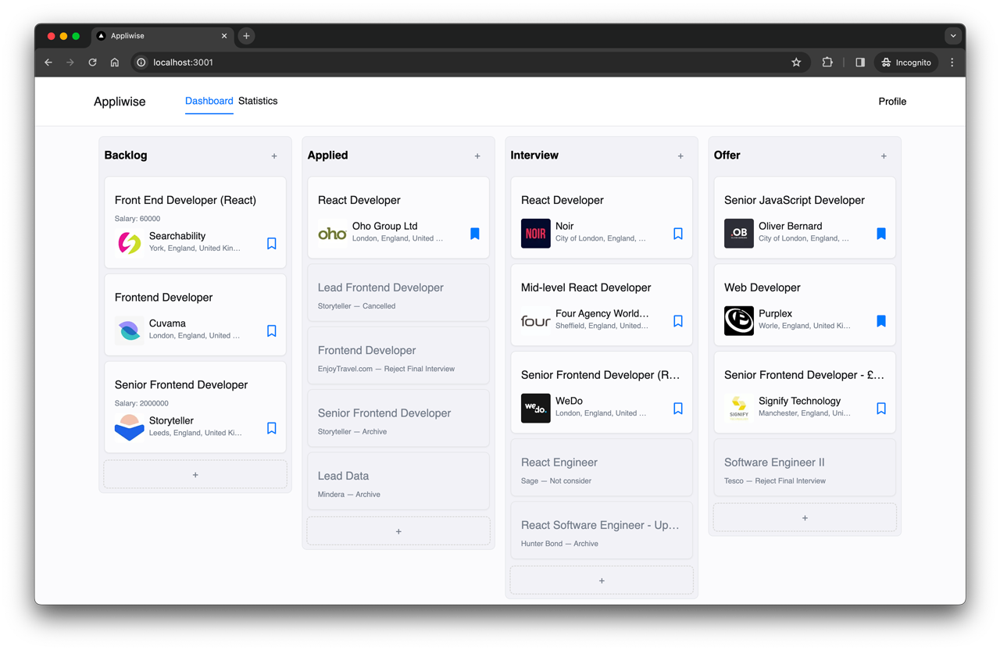

# Appliwise — Job application tracker
Actual version: 0.1.

Appliwise is an app designed to streamline your job application process.

## Screenshots

<p align="center">
  
</p>


## Getting started

1. Clone the repo

```
git clone https://github.com/khomch/appliwise.git
cd appliwise
```

2. Setup and run the server:

- Install and run `PostgreSQL` process;
- Create `Database` for the project;
- To connect to the database create `.env` file in `/server` folder with `DATABASE_URL="postgresql://your-connection-string"`;
- Install dependencies:
```bash
cd server
npm i
```
- Run the server:
```bash
npm run dev
```

3. Setup and run the client:
- Install dependencies:
```bash
cd client
npm i
```
- Run the client:
```bash
npm run dev
```


Open [http://localhost:3001](http://localhost:3001) with your browser to see the result.


## Built with
#### Frontend
* [Typescript](https://www.typescriptlang.org/) - Strongly typed programming language that builds on JavaScript.
* [Next.JS](https://nextjs.org/) - The React Framework for the Web.
* [Redux-Toolkit](https://redux-toolkit.js.org/) - Storage to share data inside the app.
* [Taiwlind CSS](https://tailwindcss.com/) - Utility-first CSS framework.
* [Figma](https://www.figma.com/) - UI design tool entirely focused on user interface design.

#### Backend
* [Node.js](https://nodejs.org/en) - Open-source, cross-platform JavaScript runtime environment.
* [Express.js](https://expressjs.com/) - Unopinionated, minimalist web framework for Node.js.
* [PostgreSQL](https://www.postgresql.org/) - Relational Database.
* [Prisma](https://tailwindcss.com/) - Node.js and TypeScript ORM.
* [Cheerio](https://www.figma.com/) - Library for parsing and manipulating HTML and XML.


## Contributing

Improvements are welcome :)

Fork the repo and do your thing. Push to your fork and submit a pull request.


## Author

Anton Khomchenko - [Github](https://github.com/khomch) - [LinkedIn](https://www.linkedin.com/in/khomchenko/)


## License

This project is licensed under the MIT License.
